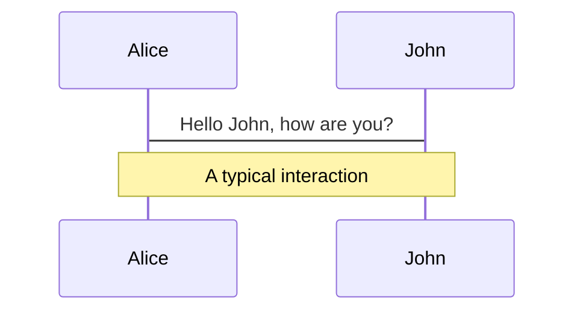

# ようこそ Slidev

Presentation slides for developers

Press Space for next page

---

# Table of contents

<Toc maxDepth="1"></Toc>

---

# Code

Use code snippets and get the highlighting directly![^1]

```ts {all|1|2}
interface User {
  id: number
  firstName: string
  lastName: string
  role: string
}

function updateUser(id: number, update: User) {
  const user = getUser(id)
  const newUser = { ...user, ...update }
  saveUser(id, newUser)
}
```

---
layout: center
---

# Diagrams

You can create diagrams / graphs from textual descriptions, directly in your Markdown.



[Learn More](https://sli.dev/guide/syntax.html#diagrams)

---
layout: center
---

# Learn More

- [Documentations](https://sli.dev)
- [GitHub](https://github.com/slidevjs/slidev)
- [Showcases](https://sli.dev/showcases.html)
